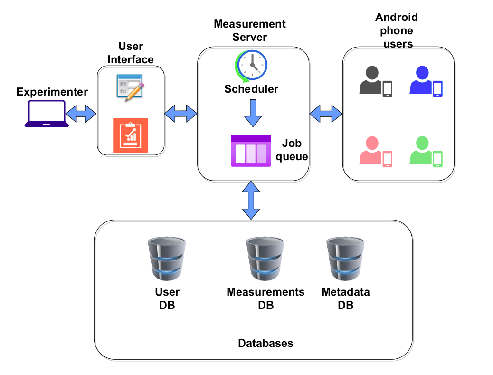

# Mobiperf Simulator

A docker-based client that can be used as a vantage point against a [custom MobiPerf server](https://github.com/staveesh/qosmon-request-handler).



The above architecture now supports Android phones as well as docker-based nodes for running 5 types of measurements - ping, DNS lookup, HTTP download, Traceroute and TCP Speed test.

To launch a docker-based node, run the below commands in order:

1. Clone this repository:

```
git clone git@github.com:staveesh/mobiperf-simulator.git
```

2. Change current directory to `mobiperf-simulator`

```
cd mobiperf-simulator
```

3. Create a `.env` file inside this directory and enter the following lines into it:

```
SERVER_PORT=value
MEASUREMENT_SERVER_ENDPOINT=ws://{mobiperf_host}:{mobiperf_port}/mobiperf
MOBIPERF_DEVICE_ID=value (A unique identifier)
MOBIPERF_SCHEDULE_FILE_PATH=/var/lib/schedule
```

4. Launch the node:

```
docker-compose up --build
```